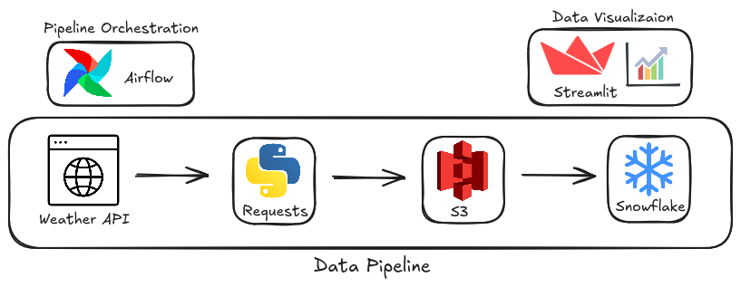
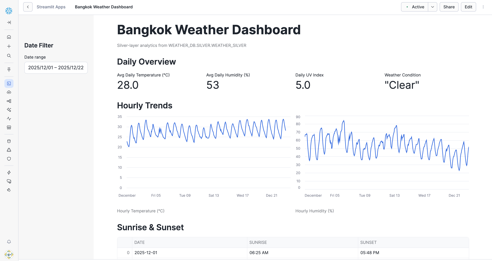

# Data Pipeline Specification: weather-data-pipeline



## Overview
- **Pipeline Name**: `weather_data_pipeline`
- **Description**: Data pipeline for weather data analytics for `{company_name}`
- **Objective**: Ingest weather data from an external API into S3 using Python, orchestrate and schedule the workflow with Apache Airflow, load and transform the data in Snowflake using a Bronze/Silver architecture, and expose curated datasets through a Snowflake-native Streamlit application for interactive analytics.
- **Frequency**: Daily batch (23:30 ICT)


## Project Folder Structure
```
├── airflow         # Folder with airflow components (docker yml, dags, scripts)
├── snowflake       # Snowflake SQL scripts
├── streamlit       # Streamlit app
├── images          # Images for repo documentation
```


## Data Sources

| Source             | Type | Location                | Description             |
|--------------------|------|-------------------------|-------------------------|
| `/v1/history.json` | API  | `api.weatherapi.com`    | Weather historical data |


## Data Landing Zone (Raw)
- **Destination**: `s3://{bucket-name}/weather/raw`
- **Format**: JSON
- **Partitioning**: `date=YYYY-MM-DD`
- **Method**: Daily extract using `target_date`
- **Tooling**: Apache Airflow DAG → PythonOperator


## Transformation Pipeline (Snowflake)
- **Database**: `weather_db`

### Bronze Layer Stage
- **Schema**: `bronze`
- External stage backed by AWS S3 using Snowflake storage integration
- Stores raw weather API responses as JSON files

### Bronze Layer Table
- **Schema**: `bronze`
- Raw ingestion from the external stage
- Data stored in **VARIANT** columns to preserve the original API payload
- Designed for schema flexibility and reprocessing

### Silver Layer
- **Schema**: `silver`
- Parse and flatten JSON fields from the bronze layer
- Cast attributes into appropriate data types (timestamps, numerics, strings)
- Add data processing metadata (e.g. ingestion and processing timestamps)


## Consumption Layer (Streamlit)
- **Connection**: Snowflake-native Streamlit application (direct query to Snowflake)
- **Datasets Exposed**: Silver-layer weather tables in `weather_db.silver`
- **Dashboards**:
  - Weather Overview Dashboard (daily temperature trends, humidity levels, weather conditions)
  - Hourly Weather Analysis (intra-day temperature and humidity patterns)
  - Location Snapshot (sunrise/sunset, geographic context, historical summaries)
- **Refresh**: Near real-time, reflecting Snowflake table updates after each pipeline run



## Orchestration

### Apache Airflow
- **DAG**: `weather_ingestion`
- **Responsibilities**:
  - Orchestrates end-to-end ingestion from the Weather API to S3
  - Ensures scheduled, repeatable, and idempotent data extraction
- **Tasks**:
  1. Validate Weather API availability and response
  2. Extract weather data and persist raw JSON files to S3
- **Schedule**:
  - `30 23 * * *` (ICT)

### Snowflake Tasks
- **Database**: `weather_db`
- **Schemas**: `bronze`, `silver`
- **Responsibilities**:
  - Automate data loading and transformation within Snowflake
- **Tasks**:
  1. Load data from S3 stage into bronze VARIANT tables
  2. Transform and load curated data from bronze into silver tables
- **Schedule**:
  - `0 1 * * *` (ICT)


## Author
Danny Khant
